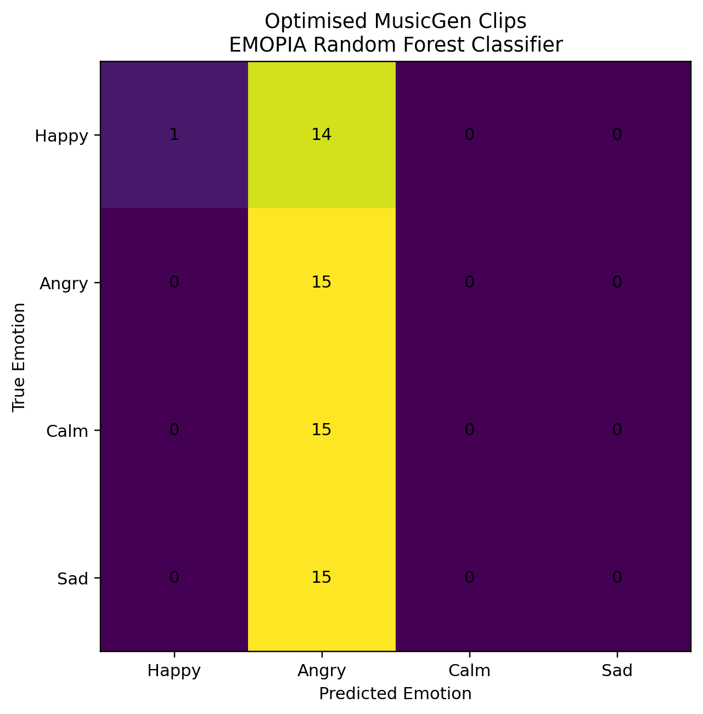
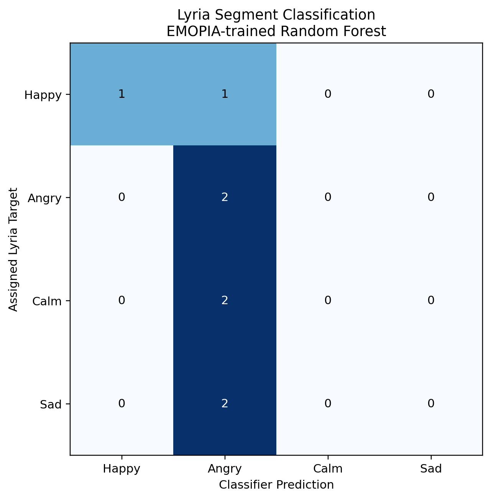

# Emotion Prompting in MusicGen-Generated Solo Piano: An Exploratory Study

**Xingyuan Song · MSc Artificial Intelligence for Media · Bournemouth University · 2026**  
Supervisor: Hammadi Nait-Charif

How clearly do emotion prompts translate into recognisable emotion in generated piano music? This repository accompanies an exploratory dissertation combining a small human listening study, acoustic analysis and an EMOPIA-trained Random Forest classifier. It also preserves two computational follow-ups: more explicit MusicGen prompts and a small Lyria segment check.

The main finding is a distinction between **perceived emotion**, **acoustic differences** and **classifier predictions**. Some acoustic features differed between the original prompt groups, while listener recognition was limited in the tested sample. The classifier's strong Angry prediction bias persisted across both MusicGen sets and appeared in the small Lyria check, supporting caution about cross-domain transfer.

**中文简介：** 本项目研究四类情绪提示下的 MusicGen 独奏钢琴输出，结合小规模人类听测、声学分析及 EMOPIA 分类器迁移分析。优化提示词和 Lyria 分段仅为计算性补充；分类器的标签匹配不能直接代表生成音乐的情绪准确率或质量。

[Results](#results-at-a-glance) · [Repository guide](#repository-guide) · [Setup](#setup) · [Run the analyses](#run-the-analyses) · [Reproducibility](#reproducibility-and-scope) · [Citation](#citation-and-reuse)

## Study design

| Target | Valence | Arousal |
| --- | --- | --- |
| Happy | High | High |
| Angry | Low | High |
| Calm | High | Low |
| Sad | Low | Low |

The **original experiment** used 60 MusicGen solo-piano clips, 15 per target, with human listening and acoustic analysis. The **optimised-prompt follow-up** used a further 60 clips with explicit musical cues. The **Lyria follow-up** used eight estimated segments from one approximately three-minute Gemini/Lyria compilation, with two assigned targets per emotion. Neither follow-up included a new human listening study.

## Results at a glance

| Analysis | Material | Reported result | Interpretation |
| --- | --- | --- | --- |
| Human listening | Six participants, 12 trials each; 72 judgements | 22/72 target matches, **30.56%** | Descriptive recognition in a small study; 25% is the four-class chance reference, not a significance test |
| EMOPIA internal validation | 1,071 usable clips; five song-grouped folds | Mean fold accuracy **62.35%** (approximately 62.3%) | Source-domain validation, not generated-music performance |
| Original MusicGen classification | 60 clips | **59 Angry, 1 Happy** | Strong cross-domain prediction bias |
| Optimised MusicGen classification | 60 additional clips | **59 Angry, 1 Happy** | The tested prompt revision did not resolve the prediction collapse |
| Lyria classification | Eight segments of one generation | **7 Angry, 1 Happy**; **3/8 assigned-label matches (37.5%)** | Exploratory descriptive agreement, not Lyria emotion accuracy |

The original acoustic analysis reported overall differences for RMS mean, RMS variability and spectral rolloff. Tempo, spectral centroid and MFCC 1 mean did not reach the reported significance threshold. See the [Kruskal–Wallis results](classifier/results/musicgen_emotion_analysis/kruskal_wallis_results.csv) and [Holm-adjusted pairwise results](classifier/results/musicgen_emotion_analysis/posthoc_pairwise_results.csv).

### Classifier outputs

**Optimised MusicGen prompts**



The source figure's “True Emotion” label denotes the **prompt target**, not a human-validated ground truth.

**Lyria exploratory segments**



These eight segments are not independent generations. Their assigned labels and estimated boundaries were not independently validated by listeners. The matrix cannot establish Lyria quality or support a ranking against MusicGen.

### Inspect the saved results without running code

- [EMOPIA fold metrics](classifier/results/cross_validation_results.csv) and [confusion matrix](classifier/results/confusion_matrix.png).
- [Original MusicGen predictions](classifier/results/musicgen_full_predictions.csv).
- [Optimised MusicGen predictions](results/optimized_predictions.csv).
- [Lyria segment predictions](classifier/results/lyria/lyria_full_predictions.csv).
- [Original MusicGen–EMOPIA domain shifts](classifier/results/domain_comparison/domain_shift_scores.csv).

Additional optimised acoustic and domain-comparison outputs are archived in `results/`. Their presence does not mean that every archived analysis is reported in the dissertation. The main manuscript's original acoustic significance tests concern the original MusicGen set.

## Repository guide

```text
musicgen-emotion-prompting/
├── README.md
├── requirements.txt
├── experiment_app.py                 # Listening interface
├── generate_optimized_60.py          # Optimised MusicGen generation
├── evaluate_optimized_clips.py       # Classifier predictions
├── analyze_optimized_features.py     # Descriptive acoustic analysis
├── compare_optimized_domains.py      # Follow-up domain comparison
├── dataset/
│   ├── output/                      # 60 original MusicGen WAV files
│   ├── output_optimized/            # 60 optimised MusicGen WAV files
│   └── metadata/                    # Available generation metadata
├── lyria_wav/                       # Eight estimated Lyria segments
├── classifier/
│   ├── features.csv                 # 1,071 EMOPIA feature rows
│   ├── models/                      # Saved RF and feature-column order
│   ├── results/                     # Validation, transfer and acoustic outputs
│   └── *.py                         # Preparation, training and evaluation
├── results/                         # Optimised-prompt outputs
├── pilot_samples/                   # Additional pilot audio
├── output/                          # Additional saved output
└── scripts/generate_music.py         # Historical listening-interface script
```

Despite its filename, `scripts/generate_music.py` currently contains a listening interface and local audio server, **not** the original MusicGen generation pipeline. Its paths are relative to the `scripts/` directory; inspect them before use. Use the root-level `experiment_app.py` for the documented listening interface.

## Setup

Clone the repository and enter its root directory:

```bash
git clone https://github.com/iiiistk229/musicgen-emotion-prompting.git
cd musicgen-emotion-prompting
python -m venv .venv
```

Activate the environment:

```powershell
# Windows PowerShell
.\.venv\Scripts\Activate.ps1
```

```bash
# macOS / Linux
source .venv/bin/activate
```

Install the direct Python dependencies:

```bash
python -m pip install -r requirements.txt
```

`requirements.txt` is an **unpinned dependency list**, not a recovered or tested environment lockfile. Choose mutually compatible package versions; saved scikit-learn/joblib artifacts may require the original versions. Generation additionally requires access to the MusicGen model files and suitable compute resources. EMOPIA rendering requires a separately installed FluidSynth executable and piano soundfont.

The repository includes audio and models, so the initial clone is several hundred megabytes. You can browse the saved CSVs and figures on GitHub without installing dependencies.

## Run the analyses

Run these commands from the repository root. They describe the archived scripts; the complete pipeline was not rerun during repository preparation. **Analysis and generation scripts can overwrite existing outputs**; use a separate working copy when preserving the archived results matters.

### 1. Evaluate existing audio with the saved classifier

```bash
python classifier/predict_musicgen_test.py
python evaluate_optimized_clips.py
python classifier/predict_lyria_test.py
```

These read the original MusicGen, optimised MusicGen and Lyria folders respectively, together with `classifier/models/random_forest_emopia.joblib` and `classifier/models/feature_columns.joblib`. They write to `classifier/results/`, `results/` and `classifier/results/lyria/`.

### 2. Inspect acoustic differences and domain shifts

```bash
# Produces the original MusicGen features used by the next script
python classifier/compare_domains.py
python classifier/analyse_musicgen_emotions.py

# Supplementary optimised-prompt analyses
python analyze_optimized_features.py
python compare_optimized_domains.py
```

The original emotion analysis reads `classifier/results/domain_comparison/musicgen_features.csv`. The comparison scripts use the included EMOPIA features in `classifier/features.csv`; rendering the entire EMOPIA dataset is unnecessary when using these saved features.

### 3. Generate the optimised MusicGen set

```bash
python generate_optimized_60.py
```

The script contains the full four prompts, covering tempo, modality where specified, register, harmony, rhythm and dynamics. Its saved configuration includes:

| Setting | Value |
| --- | --- |
| Model | `facebook/musicgen-small` |
| Clips per emotion | 15 |
| Base seed | 2026 |
| Maximum new tokens | 1,500 |
| Guidance scale | 3.0 |
| Output directory | `dataset/output_optimized/` |

These are textual cue requests, not proof that every requested musical property was realised. Seeded generation alone does not guarantee identical output across different software and hardware environments.

### 4. Launch the listening interface

```bash
python experiment_app.py
```

Open the local address printed by Gradio. The interface samples three clips per emotion from `dataset/output/` and records responses under `dataset/results/responses.csv` (excluded by `.gitignore`). Running it collects new responses; it does not reconstruct the original six-participant study or its fixed group assignments.

### 5. Rebuild the EMOPIA classifier

To retrain from the **included feature table**:

```bash
python classifier/train_classifier.py
```

The training script uses five-fold `StratifiedGroupKFold`, grouping clips by source song, and a Random Forest with 500 trees and random state 42. Retraining replaces saved model and result artifacts.

To rebuild features **from source MIDI**, first obtain the omitted data and rendering dependencies:

```bash
python classifier/get_emopia.py
python classifier/prepare_emopia.py
# Configure FluidSynth and soundfont paths in render_emopia.py before continuing
python classifier/render_emopia.py
python classifier/extract_features.py
python classifier/train_classifier.py
```

The downloader uses MusPy. `render_emopia.py` contains machine-specific Windows paths for FluidSynth and a Yamaha Disklavier piano SF2 soundfont; change these to your installation. Features are extracted from mono audio loaded at 22.05 kHz. The classifier uses 44 acoustic features, including tempo, energy, spectral, chroma and MFCC summaries.

## Reproducibility and scope

### Included

- Original and optimised MusicGen audio, eight Lyria segment WAVs and pilot outputs.
- Available generation metadata, analysis scripts, feature tables, prediction tables and figures.
- Saved classifier model and feature-column ordering.

### Not included or not fully documented

- `classifier/data/`: downloaded EMOPIA source data and associated assets.
- `classifier/wav/`: approximately 8 GB of locally rendered training audio; regeneration requires the dataset, renderer and soundfont.
- Original participant response records: no response CSV was present in the supplied snapshot. The reported 30.56% human result is carried from the dissertation, not recomputed here.
- The original MusicGen generation implementation under its historical filename, a complete version-pinned environment, and exact Lyria source-compilation/segmentation provenance and service version.
- The dissertation PDF and Overleaf source are maintained separately and are not included in this repository snapshot.

The original data and scripts are preserved as research artifacts. Target labels describe requested emotions; they are not equivalent to listener ratings. Domain mismatch is supported by the observed feature shifts and prediction patterns, but the follow-ups do not isolate a causal mechanism. No additional human listening tests were conducted for either follow-up.

## Citation and reuse

When referring to this project, identify the author, dissertation title, repository URL and the commit you used:

> Song, X. (2026). *Emotion Prompting in MusicGen-Generated Solo Piano: An Exploratory Study*. Research repository accompanying an MSc Artificial Intelligence for Media dissertation, Bournemouth University. https://github.com/iiiistk229/musicgen-emotion-prompting

This repository is public. A software licence has not yet been selected. Third-party datasets, pretrained models and soundfonts remain subject to their own terms; this repository does not assign rights to those materials.
